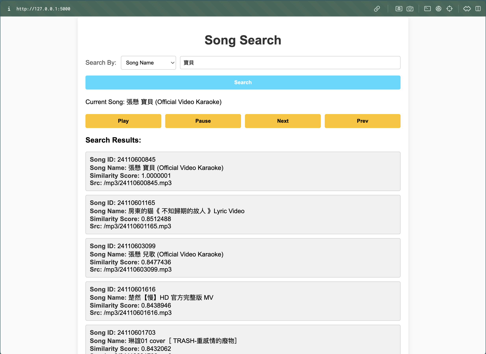

# Project Talaria

Talaria is a music player that, given a song, returns a playlist of similar songs. The similarity is determined using an AI model that analyzes the audio embeddings of the songs—songs that "sound similar" according to the model will be included in the playlist.

## Setup and Instructions

### 1. MP3 Preparation

   ```bash
   cd src/collect/
   ```

2. **Add MP3 Files:**
   - Place all MP3 files in the `raw_mp3` folder.
   - You can prepare your own MP3 files or download from YouTube using:
     ```bash
     python youtube_scraper.py --playlist_url [url]
     ```

3. **Prepare Song ID and Name Mapping:**
   - Run the following script to assign a unique `song_id` to each song and map it to the song name:
     ```bash
     python create_song_id.py
     ```

4. **Extract Highest Energy 30-Second Segments:**
   - Extract the highest-energy 30-second segment from each song, which will be used for embeddings computation:
     ```bash
     python extract_song_energy.py
     ```

### 2. Search Function

   ```bash
   cd src/search/
   ```

2. **Prepare Embeddings:**
   - Generate embeddings for each song:
     ```bash
     python get_song_emb.py
     ```

3. **Set Up Qdrant for Embedding Search:**
   - Qdrant is used as the vector database to perform similarity searches based on embeddings. Start the Qdrant instance with Docker:
     ```bash
     docker-compose up -d
     ```

4. **Store Vectors in Qdrant Collection:**
   - Add the generated embeddings to a Qdrant collection:
     ```bash
     python create_qdrant_data.py
     ```

### 3. Frontend Setup

   ```bash
   cd src/frontend/static/
   ```

2. **Install Howler.js for Audio Playback:**
   - Install `howler.js` via npm:
     ```bash
     npm install howler
     ```

### 4. Backend Setup

   ```bash
   cd src/backend/
   ```

2. **Start the Backend Server:**
   - Run the Flask application to serve the backend:
     ```bash
     python app.py
     ```

---

## Usage

- The frontend provides a search bar where users can enter a song ID or song name. Based on the input, the backend will retrieve and display a playlist of similar songs.




Enjoy using Talaria for your music exploration!

